# Data Pipeline Documentation

This document provides a comprehensive overview of the dissertation project's data pipeline, which focuses on analyzing the relationship between job postings and GitHub repositories through machine learning and natural language processing techniques.

## Project Overview

The project aims to understand the connection between job market demands and open-source software development by analyzing job descriptions and GitHub repository data using topic modeling and embedding similarity analysis.

## Pipeline Architecture

```mermaid
flowchart TD
    %% Data Sources
    A[Job Posting Data<br/>Multiple Sources] --> B[Raw Data Directory<br/>src/data/jobs/raw/]
    C[GitHub API<br/>GraphQL Queries] --> D[GitHub Data<br/>src/data/github/]
    E[OSS Insight API] --> D
    
    %% Central Configuration
    F[utils/paths.py<br/>🔑 Central Data Registry] --> B
    F --> D
    F --> G[Processed Data<br/>src/data/jobs/processed/]
    F --> H[Embeddings<br/>src/data/embeddings/]
    F --> I[Models<br/>src/models/]
    
    %% Data Acquisition
    J[data-acquisition/github_data.py<br/>GitHub GraphQL Client] --> D
    K[data-acquisition/oss_insight_scraper.py<br/>Collection Scraper] --> D
    
    %% Preprocessing
    B --> L[preprocessing/preprocess_jobdata.py<br/>Job Data Cleaning]
    L --> M[preprocessing/label_data.py<br/>Data Labeling]
    M --> G
    
    D --> N[preprocessing/case_corrector.py<br/>Text Normalization]
    N --> O[preprocessing/text_embed_prepare.py<br/>Text Preparation]
    O --> H
    
    %% Utilities
    P[utils/vars.py<br/>Model Configs] --> Q[utils/embedding.py<br/>Text Processing]
    Q --> O
    P --> R[utils/job_title_taxonomy.py<br/>Job Classification]
    R --> L
    
    %% Core Pipeline
    G --> S[bertopic_pipeline.py<br/>🔵 Main Topic Modeling]
    H --> S
    P --> S
    S --> I
    S --> T[Topic Analysis Results]
    
    %% Similarity Analysis
    H --> U[representation.py<br/>🔵 Embedding Similarity]
    G --> U
    I --> U
    U --> V[Similarity Matrices<br/>& Visualizations]
    
    %% Exploration & Analysis
    G --> W[exploration/eda.py<br/>Exploratory Analysis]
    D --> X[exploration/star_counts.py<br/>Repository Popularity]
    D --> Y[exploration/label_analysis.py<br/>Tag Analysis]
    T --> Z[exploration/ngram_analysis.py<br/>Text Patterns]
    
    %% Alternative Approaches
    AA[alternative_solutions/<br/>Alternative Methods] --> I
    
    %% GraphQL Queries
    BB[graphql/<br/>Query Templates] --> J
    
    %% Styling
    classDef keyFile fill:#ff9999,stroke:#333,stroke-width:3px
    classDef dataSource fill:#99ccff,stroke:#333,stroke-width:2px
    classDef processFile fill:#99ff99,stroke:#333,stroke-width:2px
    classDef outputData fill:#ffcc99,stroke:#333,stroke-width:2px
    
    class F,S,U keyFile
    class A,C,E dataSource
    class L,O,Q processFile
    class G,H,I,V outputData
```



## Key Components

### 🔑 Central Infrastructure

#### `utils/paths.py` - **THE MOST IMPORTANT FILE**
This is the central nervous system of the entire codebase. It provides:
- **TypedDict structures** for explicit typing and autocomplete support
- **DATA_DICT**: A comprehensive registry of all data file locations
- **Centralized path management** for consistent data access across all modules
- **Easy anonymized data access** for different file types and sources

**Key Features:**
- Organizes data paths by type (jobs, repositories, embeddings, models)
- Provides structured access to different data sources (6 job posting sources)
- Manages embedding variants and model configurations
- Enables consistent file management across the entire pipeline

#### `utils/vars.py` - Model Configuration
- Defines sentence transformer models (3 variants: MiniLM, MPNet, BGE)
- GitHub API token management
- Model parameters and constants

### 📥 Data Acquisition

#### `data-acquisition/github_data.py` - GitHub GraphQL Client
- **Custom GraphQL client** for GitHub API interactions
- Handles rate limiting and authentication
- Retrieves repository metadata, descriptions, topics, star counts
- Supports paginated queries for large datasets
- Manages GraphQL schema validation

#### `data-acquisition/oss_insight_scraper.py` - OSS Collections
- Scrapes popular repository collections from OSS Insight
- Identifies trending and significant repositories
- Supplements GitHub data with curated repository lists

#### `graphql/` - Query Templates
- Contains all GraphQL query definitions
- Schema documentation for GitHub API
- Modular query structure for different data types

### 🔄 Data Preprocessing

#### `preprocessing/preprocess_jobdata.py` - Job Data Cleaning
- **Multi-source job data consolidation** (6 different sources)
- Handles multiple file formats (CSV, JSONL)
- Data normalization and standardization
- Date conversion and filtering
- Composite field creation

#### `preprocessing/text_embed_prepare.py` - Text Preparation
- Prepares text data for embedding generation
- Handles both job descriptions and repository data
- Advanced text cleaning and preprocessing
- POS tagging and keyword extraction
- Configurable text variant generation

#### `preprocessing/case_corrector.py` - Text Normalization
- Standardizes text casing and formatting
- Handles special characters and encoding issues

#### `preprocessing/label_data.py` - Data Labeling
- Creates labeled datasets for training
- Handles data annotation and categorization

### 🧠 Core Machine Learning Pipeline

#### `bertopic_pipeline.py` - **MAIN TOPIC MODELING**
This is one of the two core analysis modules. It performs:
- **Text preprocessing** with stopword removal and cleaning
- **Sentence embedding** using configurable transformer models
- **Topic modeling** with BERTopic (HDBSCAN + UMAP)
- **Model evaluation** with silhouette scoring
- **Clustering analysis** and optimization

**Key Features:**
- Configurable vectorizer parameters (n-grams, document frequency)
- Multiple clustering algorithms (HDBSCAN, K-means)
- Dimensionality reduction with UMAP
- Model persistence and loading capabilities

#### `representation.py` - **EMBEDDING SIMILARITY ANALYSIS**
The second core analysis module, featuring:
- **Cross-domain similarity computation** (jobs ↔ repositories)
- **EmbeddingSimilarity class** for comprehensive similarity analysis
- **Statistical analysis** of embedding distributions
- **Visualization tools** for similarity matrices and comparisons
- **Model comparison** across different sentence transformers

**Key Features:**
- Computes similarity matrices between job postings and repositories
- Provides statistical summaries and visualizations
- Enables model performance comparison
- Supports interactive exploration of similar items

### 🛠️ Utility Modules

#### `utils/embedding.py` - Text Processing Engine
- **Comprehensive text processing** for both jobs and repositories
- **Sentence transformer integration** with multiple model support
- **Advanced preprocessing** with spaCy and NLTK
- **Repository-specific processing** (README cleaning, topic extraction)
- **Job-specific processing** (skill extraction, taxonomy mapping)

#### `utils/job_title_taxonomy.py` - Job Classification
- Job title standardization and categorization
- Industry and role classification systems
- Skill and competency mapping

#### `utils/plots.py` - Visualization Utilities
- Common plotting functions and color schemes
- Standardized visualization configurations

### 📊 Exploratory Analysis

#### `exploration/eda.py` - Exploratory Data Analysis
- Statistical summaries of job and repository data
- Data quality assessment and missing value analysis
- Distribution analysis and outlier detection

#### `exploration/star_counts.py` - Repository Popularity Analysis
- GitHub star count analysis and trends
- Repository popularity metrics and correlations
- Time-series analysis of repository growth

#### `exploration/label_analysis.py` - Tag and Label Analysis
- Analysis of GitHub topics and job skill tags
- Tag frequency and co-occurrence analysis
- Label categorization and clustering

#### `exploration/ngram_analysis.py` - Text Pattern Analysis
- N-gram extraction and frequency analysis
- Text pattern identification and trends
- Language model insights

### 🔄 Alternative Solutions

#### `alternative_solutions/` - Experimental Approaches
- **`fetch_github_webscraper.py`**: Web scraping alternative to GraphQL
- **`label_categorize.py`**: Alternative labeling approaches
- **`training.py`**: Additional training methodologies

## Data Flow Overview

### 1. **Data Collection Phase**
- Multiple job posting sources → Raw job data
- GitHub GraphQL API → Repository metadata, descriptions, topics
- OSS Insight API → Curated repository collections

### 2. **Data Preprocessing Phase**
- Raw job data → Cleaned and standardized job information
- Raw repository data → Processed repository information
- Text normalization → Consistent text formats
- Data preparation → Embedding-ready text

### 3. **Feature Engineering Phase**
- Text processing → Clean, processed text
- Embedding generation → Vector representations
- Text variant creation → Multiple embedding approaches

### 4. **Analysis Phase**
- **Topic Modeling**: BERTopic pipeline discovers thematic clusters
- **Similarity Analysis**: Cross-domain embedding similarity computation
- **Statistical Analysis**: Comprehensive model evaluation and comparison

### 5. **Exploration Phase**
- Exploratory data analysis across multiple dimensions
- Visualization and insight generation
- Model performance evaluation

## Data Organization

### Jobs Data Structure
```
src/data/jobs/
├── raw/           # Original job posting files (6 sources)
├── intermediate/  # Partially processed data
└── processed/     # Final cleaned job data (master.csv)
```

### GitHub Data Structure
```
src/data/github/
├── repositories/  # Repository metadata and information
├── star_counts/   # Star count time series data
├── star_wide/     # Aggregated star data (daily/monthly/quarterly)
├── tags/          # Topic tags and categorizations
└── meta_data/     # Complete repository metadata
```

### Embeddings Structure
```
src/data/embeddings/
├── values/        # Computed embedding vectors (.npy files)
├── text/          # Prepared text for embedding (variant 1)
└── text2/         # Alternative text preparation (variant 2)
```

## Key Configuration Files

- **`requirements.txt`**: Python dependencies
- **`models/text-embed-variants.txt`**: Available text processing variants
- **`utils/github_credentials.txt`**: GitHub API credentials (secure)

## Model Variants

### Sentence Transformer Models
- **Model A**: `all-MiniLM-L6-v2` (lightweight, fast)
- **Model B**: `all-mpnet-base-v2` (balanced performance)
- **Model C**: `BAAI/bge-base-en-v1.5` (state-of-the-art)

### Text Processing Variants
- Multiple preprocessing approaches for different analysis needs
- Configurable through command-line arguments
- Supports experimental text processing methods

## Running the Pipeline

### Prerequisites
1. Install dependencies: `pip install -r requirements.txt`
2. Configure GitHub API token in `utils/vars.py`
3. Ensure data directories exist as defined in `utils/paths.py`

### Execution Order
1. **Data Collection**: Run data acquisition scripts
2. **Preprocessing**: Execute preprocessing pipeline
3. **Text Preparation**: Generate embedding-ready text
4. **Embedding Generation**: Create vector representations
5. **Topic Modeling**: Run BERTopic pipeline
6. **Similarity Analysis**: Execute representation analysis
7. **Exploration**: Run exploratory analysis scripts

### Key Entry Points
- **Main Topic Modeling**: `python bertopic_pipeline.py`
- **Similarity Analysis**: `python representation.py`
- **Text Preparation**: `python preprocessing/text_embed_prepare.py --text_variant [variant]`
- **Data Collection**: `python data-acquisition/github_data.py`

## Integration Points

The codebase is designed with strong integration between components:
- **Centralized Configuration**: All paths managed through `utils/paths.py`
- **Consistent Data Access**: TypedDict structures ensure type safety
- **Modular Design**: Each component can be run independently
- **Flexible Configuration**: Model and processing variants support experimentation
- **Comprehensive Analysis**: Multiple analysis approaches for robust insights

This pipeline enables comprehensive analysis of the relationship between job market demands and open-source software development through advanced NLP and machine learning techniques. 